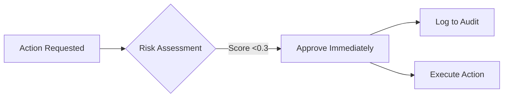
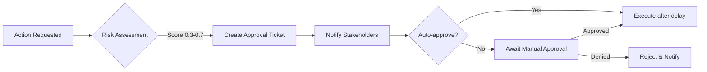
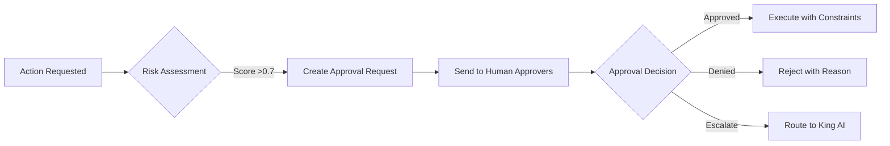

# King AI v2 Risk Approval System

The risk approval system is the governance layer that ensures King AI v2 operates safely within defined boundaries. It implements automated risk assessment, tiered approvals, and comprehensive audit trails.

## Risk Architecture

```
┌──────────────────────────────────────────────────────────────┐
│                    RISK ASSESSMENT ENGINE                     │
├──────────────────────────────────────────────────────────────┤
│                                                               │
│   ┌──────────┐   ┌──────────┐   ┌──────────┐                │
│   │  Risk    │   │  Risk    │   │  Risk    │                │
│   │Profile A │   │Profile B │   │Profile C │                │
│   │(Low)     │   │(Medium)  │   │(High)    │                │
│   └────┬─────┘   └────┬─────┘   └────┬─────┘                │
│        │              │              │                       │
│        └──────────────┼──────────────┘                       │
│                       │                                      │
│                       ▼                                      │
│              ┌───────────────┐                              │
│              │    ACTION     │                              │
│              │   DECISION    │                              │
│              │    ENGINE     │                              │
│              └───────┬───────┘                              │
│                      │                                      │
│         ┌────────────┼────────────┐                        │
│         ▼            ▼            ▼                        │
│   ┌──────────┐ ┌──────────┐ ┌──────────┐                │
│   │APPROVED  │ │CONDITIONAL│ │  DENIED  │                │
│   │(Auto)    │ │(Escalated)│ │(Blocked)  │                │
│   └──────────┘ └──────────┘ └──────────┘                │
│                                                               │
└──────────────────────────────────────────────────────────────┘
```

## Risk Profiles

### Risk Profile A (Low Risk)

| Attribute | Threshold |
|-----------|-----------|
| **Financial Exposure** | <$500 |
| **Reversibility** | Fully reversible within 24h |
| **Data Access** | Public or synthetic data |
| **External Commitments** | None |
| **Compliance Scope** | No regulated industries |

**Examples:**
- Content creation and publishing
- Internal tool configuration changes
- A/B testing (low traffic)
- Social media posting

**Approval:** Fully automated

### Risk Profile B (Medium Risk)

| Attribute | Threshold |
|-----------|-----------|
| **Financial Exposure** | $500 - $10,000 |
| **Reversibility** | Reversible within 7 days |
| **Data Access** | Customer data (anonymized) |
| **External Commitments** | <30 day contracts |
| **Compliance Scope** | General data protection |

**Examples:**
- Marketing campaign launches
- Vendor onboarding (under $5k/month)
- Pricing experiments
- Feature flag releases

**Approval:** Automated + notification to manager

### Risk Profile C (High Risk)

| Attribute | Threshold |
|-----------|-----------|
| **Financial Exposure** | >$10,000 |
| **Reversibility** | Difficult or costly to reverse |
| **Data Access** | PII, financial data, health data |
| **External Commitments** | Annual contracts, legal obligations |
| **Compliance Scope** | Regulated industries (HIPAA, SOX, etc.) |

**Examples:**
- Major contract signing
- Database schema changes
- Security policy changes
- Financial reporting

**Approval:** Requires human-in-the-loop approval

## Risk Scoring Algorithm

Risk scores are calculated using multiple dimensions:

```python
class RiskCalculator:
    def calculate(self, action: Action) -> RiskScore:
        dimensions = {
            'financial': self.score_financial(action),
            'reversibility': self.score_reversibility(action),
            'data_sensitivity': self.score_data(action),
            'compliance': self.score_compliance(action),
            'reputation': self.score_reputation(action)
        }
        
        # Weighted average
        weights = {
            'financial': 0.30,
            'reversibility': 0.25,
            'data_sensitivity': 0.20,
            'compliance': 0.15,
            'reputation': 0.10
        }
        
        score = sum(dimensions[k] * weights[k] for k in dimensions)
        
        if score < 0.3:
            return RiskScore(score, RiskProfile.A)
        elif score < 0.7:
            return RiskScore(score, RiskProfile.B)
        else:
            return RiskScore(score, RiskProfile.C)
```

## Approval Workflows

### Automatic Approval (Profile A)



**Timing:** <100ms  
**Notifications:** None (unless configured)  
**Audit:** Full capture to [[database-schema#approval_logs]]

### Conditional Approval (Profile B)



**Timing:** 5-minute window for objection  
**Notifications:** Slack + Email to relevant managers  
**Escalation:** If no response in 15 minutes, escalate

### Human Approval Required (Profile C)



**Timing:** Awaiting human response  
**Escalation:** After 1 hour, escalate to next approver  
**Constraints:** Annotated execution limits

## Approval Dashboard

Real-time view of pending approvals:

| Request ID | Action | Risk Score | Profile | Requested | Approver | Age |
|------------|--------|------------|---------|-----------|----------|-----|
| req-1234 | Launch Campaign | 0.45 | B | 10:30 AM | @alpha-manager | 5m |
| req-1235 | Sign Vendor | 0.82 | C | 10:15 AM | @landon | 20m |
| req-1236 | Pricing Change | 0.38 | B | 09:45 AM | AUTO-APPROVED | - |

**Filters:**
- By business unit
- By risk profile
- By approver
- By age
- By action type

## Exception Handling

### Emergency Override

In critical situations, emergency override bypasses normal workflow:

```python
class EmergencyOverride:
    REQUIREMENTS = [
        "Two-factor confirmation",
        "Justification documented",
        "Post-hoc review scheduled"
    ]
    
    def execute(self, action, approver):
        # Immediate execution
        result = action.execute()
        
        # Compulsory audit
        self.create_incident_report(
            action=action,
            approver=approver,
            timestamp=now(),
            justification=approver.justification
        )
        
        # Schedule review
        self.schedule_review(
            incident_id=result.incident_id,
            review_date=now() + timedelta(days=7)
        )
        
        return result
```

### Risk Model Overrides

Managers can override risk calculations with documented rationale:

```json
{
  "override": true,
  "original_profile": "B",
  "target_profile": "A",
  "rationale": "Pre-negotiated vendor, regulatory requirements met",
  "approver": "@alpha-manager",
  "expires": "2026-06-01"
}
```

## Audit Trail

All approvals are logged immutably:

| Field | Type | Description |
|-------|------|-------------|
| request_id |