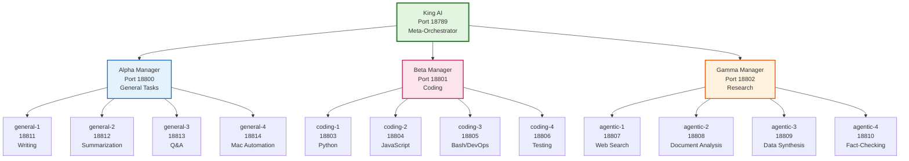
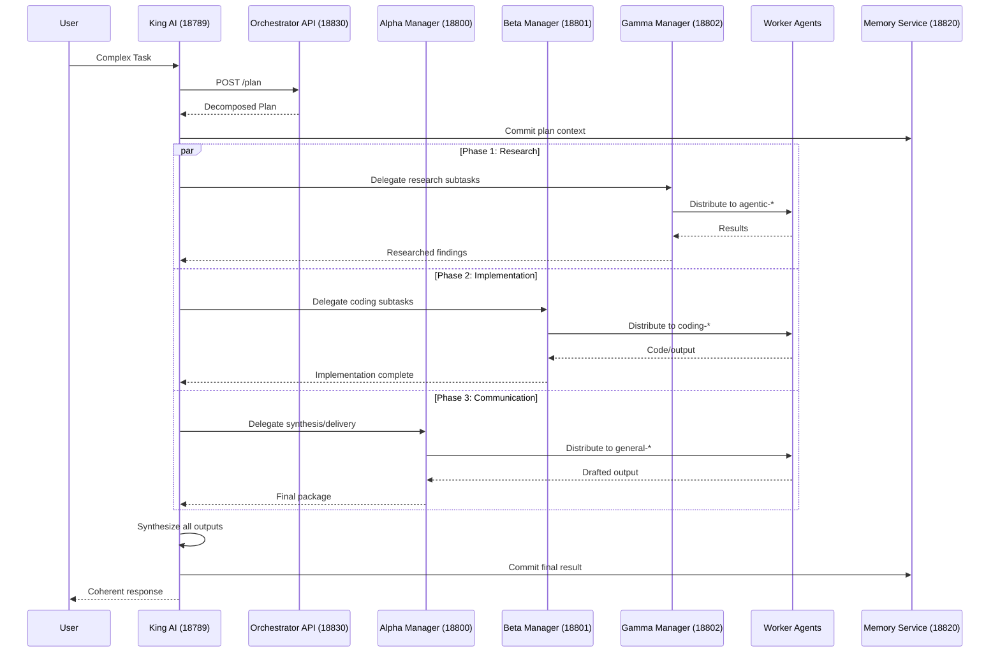
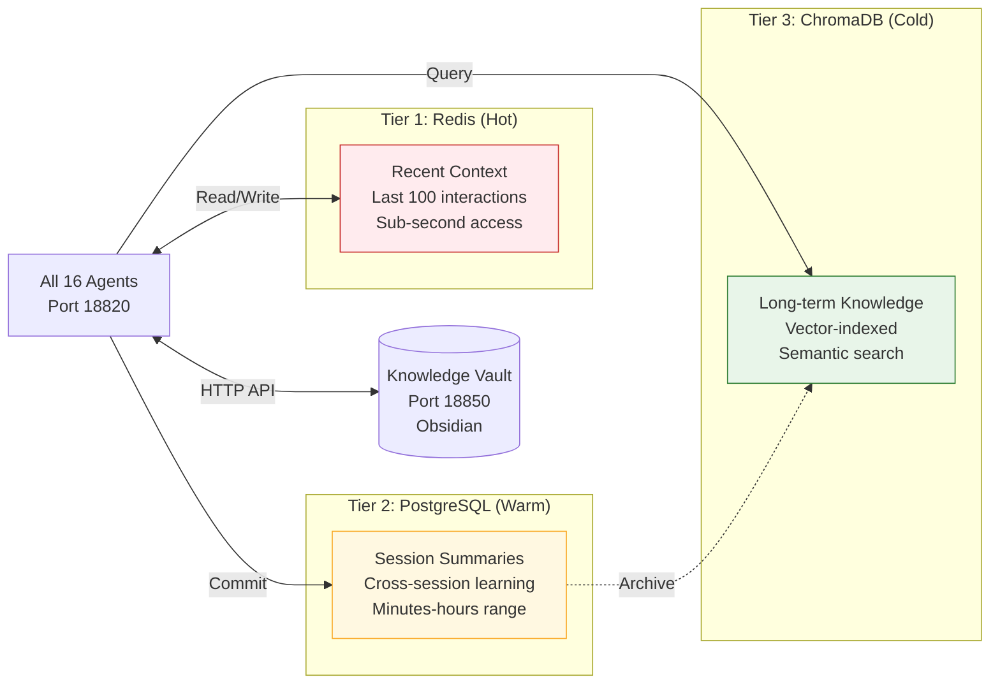

# King AI v2 Documentation 🎯

> *"I am the planner, not the doer. I see the whole board and move the pieces."*

## Navigation

- [[king-ai-v2-documentation#Architecture Overview|Architecture]]
- [[king-ai-v2-documentation#Agent Capability Matrix|Capability Matrix]]
- [[king-ai-v2-documentation#Business Lifecycle|Task Lifecycle]]
- [[king-ai-v2-documentation#Risk Profiles|Risk Profiles]]
- [[king-ai-v2-documentation#Integration Mapping|Integrations]]

---

## Architecture Overview

King AI v2 implements a **three-tier hierarchical orchestration pattern** designed for complex multi-domain task execution. Unlike simple router-based systems, King AI acts as a strategic planner that decomposes tasks, manages dependencies, and synthesizes outputs from specialized manager teams.

### System Philosophy

The architecture follows the principle: **"Plan before acting"**. King AI does not merely classify and route—it creates comprehensive execution plans with explicit phase dependencies, distributes work to domain managers, tracks progress, and synthesizes final outputs from distributed results.

### Hierarchical Structure



### Communication Flow



### Data Flow Architecture



---

## Agent Capability Matrix

| Agent | Port | Reports To | Domain | Specialty | Primary Tools | Restrictions |
|-------|------|------------|--------|-----------|---------------|--------------|
| **King AI** | 18789 | — | Orchestration | Strategic Planning | `sessions_send`, `memory_*`, `diary`, `reflect` | Cannot execute directly; plans only |
| **Alpha Manager** | 18800 | 18789 | General | Task Synthesis | `sessions_send` to workers, `memory_*` | No shell execution |
| **Beta Manager** | 18801 | 18789 | Coding | Code Coordination | `sessions_send`, code review | No direct coding |
| **Gamma Manager** | 18802 | 18789 | Research | Research Coordination | `sessions_send`, synthesis | No direct search |
| **general-1** | 18811 | 18800 | Writing | Technical Writing | `read`, `write`, `edit` | No shell, sandboxed FS |
| **general-2** | 18812 | 18800 | Summarization | Content Condensation | `read`, `web_fetch`, `summarize` | No shell, sandboxed FS |
| **general-3** | 18813 | 18800 | Q&A | Question Answering | `read`, `memory_search`, `get_memory_context` | No shell, sandboxed FS |
| **general-4** | 18814 | 18800 | Automation | Mac Automation | `exec` (elevated via approval), `read`, `write` | Requires elevation for exec |
| **coding-1** | 18803 | 18801 | Coding | Python Development | `read`, `write`, `edit`, `exec` (via approval) | No shell without approval |
| **coding-2** | 18804 | 18801 | Coding | JavaScript/TypeScript | `read`, `write`, `edit`, `exec` (via approval) | No shell without approval |
| **coding-3** | 18805 | 18801 | Coding | Bash/Infrastructure | `read`, `write`, `edit`, `exec` (via approval) | No shell without approval |
| **coding-4** | 18806 | 18801 | Coding | Testing/Review | `read`, `edit`, `sessions_spawn` | No shell without approval |
| **agentic-1** | 18807 | 18802 | Research | Web Search | `web_search`, `web_fetch` | No shell, sandboxed FS |
| **agentic-2** | 18808 | 18802 | Research | Document Analysis | `web_fetch`, `read`, `summarize` | No shell, sandboxed FS |
| **agentic-3** | 18809 | 18802 | Research | Data Synthesis | `read`, `memory_search`, `reflect` | No shell, sandboxed FS |
| **agentic-4** | 18810 | 18802 | Research | Fact-Checking | `web_search`, `web_fetch`, `memory_search` | No shell, sandboxed FS |

### Permission Requirements by Role

| Role | Cross-Agent Messaging | Shell Execution | Filesystem Scope | Reasoning Patterns | Elevation Authority |
|------|----------------------|----------------|------------------|-------------------|---------------------|
| **King AI** | ✅ All agents | ✅ Full | ✅ Unrestricted | ✅ All three | ✅ Can grant (via escalation) |
| **Managers** | ✅ Own workers only | ✅ Limited | ✅ Unrestricted | ✅ All three | ✅ Can approve workers |
| **Workers** | ❌ Manager only | 🟡 Via elevation | 🟡 Own workspace only | ✅ All three | ❌ Cannot grant |

---

## Business Lifecycle

### Task State Machine

```mermaid
stateDiagram-v2
    [*] --> Received: User Request
    
    Received --> Analyzing: King AI receives
    
    Analyzing --> Planning: Task decomposed
    Analyzing -->