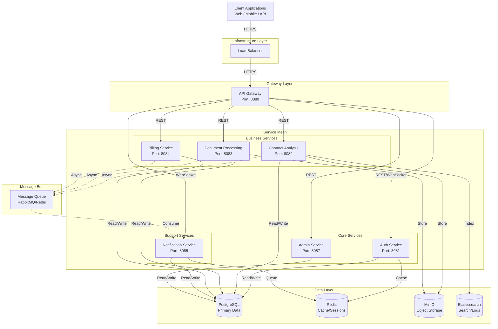

# King AI v2 - Microservices Architecture
## Part A: Service Decomposition & Specification

**Version:** 1.0  
**Status:** Draft  
**Updated:** 2026-01-12

---

## Service Decomposition Diagram



---

## 1. API Gateway Service

### Responsibilities
- Single entry point for all client requests
- Request routing to appropriate microservices
- Rate limiting and throttling
- SSL termination
- Request/response transformation
- CORS handling
- API versioning
- Basic caching

### API Endpoints

| Method | Endpoint | Target Service | Description |
|--------|----------|----------------|-------------|
| POST | `/v1/auth/*` | Auth Service | Authentication proxy |
| GET/POST | `/v1/contracts/*` | Contract Analysis | Contract API proxy |
| POST | `/v1/documents/*` | Document Processing | Document API proxy |
| GET/POST | `/v1/billing/*` | Billing Service | Billing API proxy |
| WS | `/v1/ws/notifications` | Notification Service | Real-time notifications |
| GET/POST | `/v1/admin/*` | Admin Service | Admin API proxy |
| GET | `/health` | Internal | Gateway health check |

### Configuration
```yaml
rate_limits:
  default: 100/minute
  auth: 10/minute
  contracts: 50/minute
  
cors:
  allowed_origins: ["https://kingai.com", "https://admin.kingai.com"]
  allowed_methods: ["GET", "POST", "PUT", "DELETE"]
  
circuit_breaker:
  failure_threshold: 5
  timeout_seconds: 30
```

### Dependencies
- **Upstream:** All microservices
- **Downstream:** Load Balancer
- **Data:** None (stateless)

---

## 2. Auth Service

### Responsibilities
- User authentication (email/password, OAuth2, SAML)
- JWT token generation and validation
- Session management
- Password reset flows
- Multi-factor authentication (MFA)
- API key management
- Role-based access control (RBAC)

### API Specification

#### REST Endpoints

```yaml
# POST /v1/auth/register
Request:
  body:
    email: string (email)
    password: string (min 8 chars)
    firstName: string
    lastName: string
Response:
  201:
    userId: uuid
    email: string
    createdAt: datetime
    requiresVerification: boolean

# POST /v1/auth/login
Request:
  body:
    email: string
    password: string
    deviceId?: string
Response:
  200:
    accessToken: string (JWT)
    refreshToken: string
    expiresIn: integer (seconds)
    user:
      userId: uuid
      email: string
      roles: [string]

# POST /v1/auth/refresh
Request:
  body:
    refreshToken: string
Response:
  200:
    accessToken: string
    expiresIn: integer

# POST /v1/auth/logout
Request:
  headers:
    Authorization: Bearer {token}
Response:
  204: No Content

# GET /v1/auth/verify/{token}
Response:
  200:
    valid: boolean
    userId: uuid
    roles: [string]
    scopes: [string]
    expiresAt: datetime

# POST /v1/auth/mfa/enable
Request:
  headers:
    Authorization: Bearer {token}
Response:
  200:
    secret: string (TOTP secret)
    qrCode: string (data URI)

# GET /v1/auth/permissions
Request:
  headers:
    Authorization: Bearer {token}
Response:
  200:
    permissions: [string]
    roles: [string]
```

### WebSocket Events
- `auth.session_expired` - Notify of imminent token expiration
- `auth.force_logout` - Admin forced logout

### Data Schema

```sql
-- users table
CREATE TABLE users (
    user_id UUID PRIMARY KEY,
    email VARCHAR(255) UNIQUE NOT NULL,
    password_hash VARCHAR(255) NOT NULL,
    first_name VARCHAR(100),
    last_name VARCHAR(100),
    status VARCHAR(20) DEFAULT 'active', -- active, suspended, pending
    mfa_enabled BOOLEAN DEFAULT false,
    mfa_secret VARCHAR(255),
    created_at TIMESTAMP DEFAULT NOW(),
    updated_at TIMESTAMP DEFAULT NOW()
);

-- roles table
CREATE TABLE roles (
    role_id UUID PRIMARY KEY,
    name VARCHAR(50) UNIQUE NOT NULL,
    description TEXT,
    permissions JSONB
);

-- user_roles junction
CREATE TABLE user_roles (
    user_id UUID REFERENCES users(user_id),
    role_id UUID REFERENCES roles(role_id),
    PRIMARY KEY (user_id, role_id)
);

-- sessions table (Redis-backed)
-- Key: session:{user_id}:{device_id}
-- Value: { token, expires_at, device_info }

-- refresh_tokens table
CREATE TABLE refresh_tokens (
    token_id UUID PRIMARY KEY,
    user_id UUID REFERENCES users(user_id),
    token_hash VARCHAR(255) NOT NULL,
    device_id VARCHAR(255),
    expires_at TIMESTAMP NOT NULL,
    revoked BOOLEAN DEFAULT false
);
```

### Dependencies
- **Upstream:** API Gateway
- **Downstream:** PostgreSQL (users, roles), Redis (sessions)
- **External:** OAuth providers (Google, Microsoft), Email service

---

## 3. Contract Analysis Service

### Responsibilities
- Upload and store legal contracts
- AI-powered contract analysis using LLM
- Risk identification and scoring
- Clause extraction and categorization
- Compliance checking
- Contract comparison/diff
- Analysis history and versioning

### API Specification

```yaml
# POST /v1/contracts/upload
Request:
  headers:
    Authorization: Bearer {token}
    Content-Type: multipart/form-data
  body:
    file: binary (PDF, DOCX, TXT)
    contractType: enum [employment, lease, nda, service, custom]
    clientReference?: string
    jurisdiction?: string
Response:
  201:
    contractId: uuid
    status: "processing"
    uploadId: string
    estimatedSeconds: integer

# GET /v1/contracts/{contractId}
Request:
  headers:
    Authorization: Bearer {token}
Response:
  200:
    contractId: uuid
    fileName: string
    contractType: string
    status: enum [processing, analyzed, failed]
    uploadedAt: datetime
    fileSize: integer
    storagePath: string
    # If analyzed:
    analysis?:
      overallRisk: enum [low, medium, high, critical]
      riskScore: integer (0-100)
      summary: text
      keyFindings: [string]
      clauses:
        - type: string
          text: string
          risk: enum [low, medium, high]
          page: integer
      recommendations: [text]
      analyzedAt: datetime
      modelVersion: string

# POST /