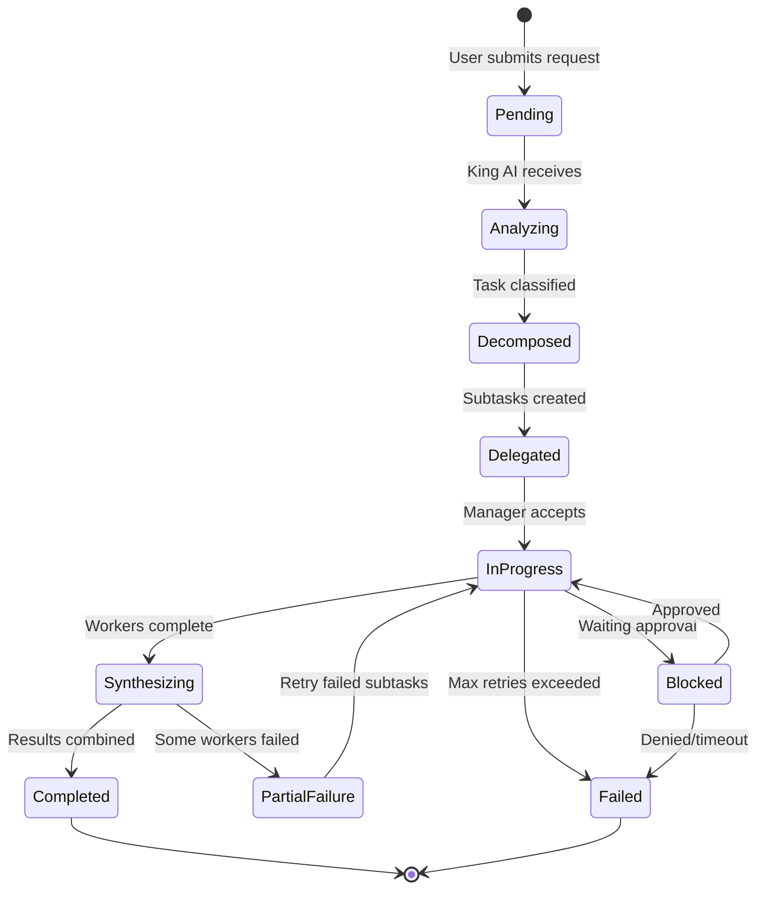
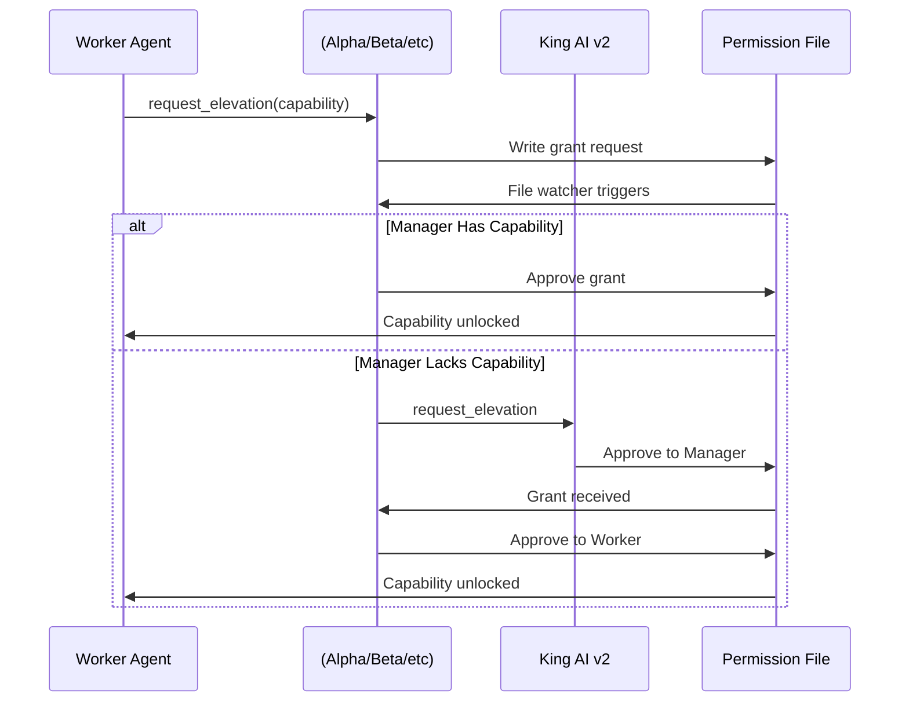

# ---

---
title: King AI v2 - Business Lifecycle State Transitions
agent: alpha-manager
date: 2026-03-10
version: 2.0.0
tags:
  - type/process
  - project/king-ai-v2
  - system/lifecycle
  - status/current
---

# King AI v2 - Business Lifecycle State Transitions

Complete state machine documentation for workflow and task lifecycle management.

## Workflow Lifecycle

## Task State Definitions

### Workflow-Level States

| State | Description | Responsible Agent |
|-------|-------------|-------------------|
| **Pending** | Request received, awaiting processing | King AI v2 |
| **Analyzing** | Classification and routing decision | King AI v2 |
| **Decomposed** | Broken into subtasks by orchestrator | Orchestrator (18830) |
| **Delegated** | Subtasks assigned to managers | King AI v2 |
| **In Progress** | Subtasks being executed by workers | Managers |
| **Synthesizing** | Results being combined | King AI / Alpha |
| **Blocked** | Waiting for approval/elevation | Permission Broker |
| **Partial Failure** | Some subtasks failed | Manager / King AI |
| **Completed** | All subtasks succeeded | King AI v2 |
| **Failed** | Unable to complete after retries | King AI v2 |

### Subtask-Level States

| State | Description | Can Transition To |
|-------|-------------|-------------------|
| **Created** | Subtask generated by orchestrator | Queued |
| **Queued** | Waiting for agent availability | Assigned, Cancelled |
| **Assigned** | Given to specific worker/agent | Running, Unassigned |
| **Running** | Actively being executed | Success, Failed, Blocked |
| **Blocked** | Waiting for elevation approval | Running, Failed |
| **Success** | Completed successfully | — |
| **Failed** | Error or exception | Retrying, Failed_Final |
| **Retrying** | Queued for retry attempt | Running, Failed_Final |
| **Failed_Final** | Max retries exceeded | — |
| **Cancelled** | User or system cancellation | — |
| **Unassigned** | Worker unavailable, requeued | Queued, Failed |

## State Transition Rules

### Workflow Transitions

| From | To | Trigger | Timeout |
|------|-----|---------|---------|
| Pending → Analyzing | Auto | Request received | N/A |
| Analyzing → Decomposed | Auto | Classification complete | 30s |
| Decomposed → Delegated | Auto | Subtask list ready | 10s |
| Delegated → In Progress | Auto | Manager ACK received | 60s |
| In Progress → Synthesizing | Auto | All subtasks Success | Variable |
| In Progress → Blocked | Auto | Elevation request pending | 5 min |
| Blocked → In Progress | Approval | Manager grants capability | 30 min |
| Blocked → Failed | Denial | Request denied/no response | 30 min |
| Partial Failure → In Progress | Auto | Retry policy triggered | N/A |
| Partial Failure → Failed | Auto | Max retries exceeded | N/A |

### Subtask Transitions

| From | To | Trigger | Retry Count |
|------|-----|---------|-------------|
| Failed → Retrying | Auto | retry_count < max | +1 |
| Failed → Failed_Final | Auto | retry_count >= max | — |
| Assigned → Unassigned | Timeout | Worker no ACK | 0 |
| Running → Failed | Error | Exception thrown | +1 |

## Retry Policies

### Worker-Level Retries

| Failure Type | Max Retries | Backoff Strategy | Escalation |
|--------------|-------------|------------------|------------|
| Timeout | 3 | Linear 30s | → Manager |
| Tool Error | 2 | Immediate | → Manager |
| Permission Denied | 1 | N/A | → Elevation Request |
| Worker Offline | 2 | Linear 10s | → Reassign |

### Manager-Level Retries

| Failure Type | Max Retries | Action |
|--------------|-------------|--------|
| Worker Failure | 1 | Spawn overflow agent |
| All Workers Down | 0 | Handle directly |
| Elevation Timeout | 0 | Escalate to King AI |

## Elevation Request Lifecycle

## Elevation States

| State | Description | Duration |
|-------|-------------|----------|
| **Requested** | Worker submitted request | Until approved/denied |
| **Pending Manager** | Waiting for manager review |
