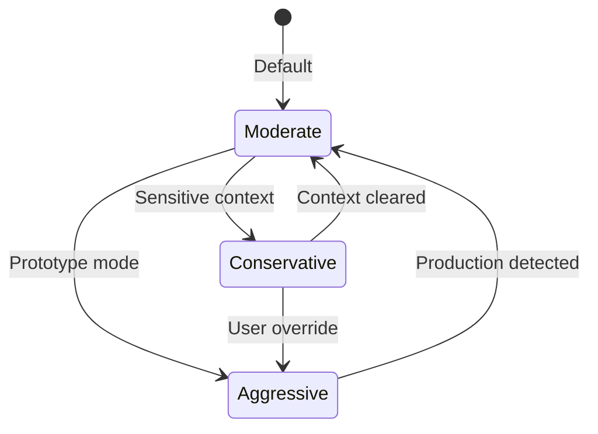

# ---

---
title: King AI v2 - Risk Profile Comparison
agent: alpha-manager
date: 2026-03-10
version: 2.0.0
tags:
  - type/policy
  - project/king-ai-v2
  - system/risk
  - status/current
---

# King AI v2 - Risk Profile Comparison

Risk tolerance configurations for different operational modes.

## Risk Profiles Overview

| Profile | Use Case | Verification | Speed | Safety |
|-----------|----------|--------------|-------|--------|
| **Conservative** | Production, sensitive data | High | Slow | Maximum |
| **Moderate** | Development, general tasks | Medium | Balanced | Standard |
| **Aggressive** | Prototyping, exploration | Low | Fast | Minimal |

## Conservative Profile

### Configuration
```json
{
  "risk_profile": "conservative",
  "auto_exec": false,
  "auto_browser": false,
  "require_approval_for": [
    "file_write",
    "file_delete",
    "shell_exec",
    "web_post",
    "message_send",
    "git_push"
  ],
  "max_retries": 5,
  "elevation_duration_max": 30,
  "pattern": "reflective_execute",
  "validation": "strict",
  "logging": "comprehensive"
}
```

### Characteristics

| Aspect | Setting | Rationale |
|--------|---------|-----------|
| Shell Execution | Manual approval required | Prevents accidental damage |
| File Writes | Approved paths only | Protects critical files |
| Web Actions | GET only, POST blocked | Prevents unintended mutations |
| External Messages | Require confirmation | Avoid accidental sends |
| Reasoning | reflective_execute | Built-in validation |
| Subagents | Verify before spawn | Prevent runaway tasks |

### Approval Requirements

| Action | Approval From | Timeout |
|--------|--------------|---------|
| `exec rm -rf` | King AI | Immediate denial |
| `write` to system paths | Manager | 5 min |
| `browser` navigation | Manager | 10 min |
| `message` send | Manager | 5 min |
| `sessions_spawn` | Manager | 2 min |
| `gateway` restart | King AI only | 60 min |

## Moderate Profile

### Configuration
```json
{
  "risk_profile": "moderate",
  "auto_exec": ["read-only", "build", "test"],
  "auto_browser": ["navigation", "screenshot"],
  "require_approval_for": [
    "file_delete",
    "git_push",
    "message_send",
    "exec_delete"
  ],
  "max_retries": 3,
  "elevation_duration_max": 60,
  "pattern": "react_execute",
  "validation": "standard",
  "logging": "standard"
}
```

### Characteristics

| Aspect | Setting | Rationale |
|--------|---------|-----------|
| Shell Execution | Whitelist: build, test, read | Common ops are safe |
| File Writes | Allowed with backup | Enable productivity |
| Web Actions | GET + safe POST | Enable automation |
| External Messages | Soft confirmation | Warn but allow |
| Reasoning | react_execute | Balance speed/quality |
| Subagents | Auto with limits | Reasonable delegation |

### Approval Requirements

| Action | Approval From | Auto-allow? |
|--------|--------------|-------------|
| `exec npm test` | — | ✅ Yes |
| `exec rm build/` | — | ✅ Yes (safe path) |
| `exec rm -rf /` | Any manager | ❌ Never |
| `git push main` | Manager | Requires approval |
| `message` to new contact | Manager | ❌ No |
| `message` to known thread | — | ✅ Yes |

## Aggressive Profile

### Configuration
```json
{
  "risk_profile": "aggressive",
  "auto_exec": true,
  "auto_browser": true,
  "require_approval_for": [
    "git_force_push",
    "exec_sudo",
    "system_restart"
  ],
  "max_retries": 1,
  "elevation_duration_max": 240,
  "pattern": "direct",
  "validation": "minimal",
  "logging": "errors_only"
}
```

### Characteristics

| Aspect | Setting | Rationale |
|--------|---------|-----------|
| Shell Execution | Auto-execute | Maximum speed |
| File Writes | Unrestricted | No friction |
| Web Actions | Full access | Complete automation |
| External Messages | Auto-send | Streamline workflow |
| Reasoning | Direct response | Fastest path |
| Subagents | Unlimited | Full delegation |

### Approval Requirements

| Action | Approval From | Reason |
|--------|--------------|--------|
| `git push --force` | Manager | Destructive |
| `exec sudo ...` | King AI | Privilege escalation |
| `gateway` restart | King AI | System-wide |
| `rm -rf /` | — | ❌ Blocked always |

## Profile Selection Matrix

| Scenario | Recommended | Override |
|----------|-------------|----------|
| Production deployment | Conservative | King AI |
| Financial operations | Conservative | — |
| Personal file organization | Moderate | — |
| Draft writing | Moderate | — |
| Code experimentation | Aggressive | — |
| API exploration | Aggressive | — |
| System administration | Conservative | — |
| Quick queries | Aggressive | — |

## Profile Transitions



## Risk Assessment Tool

The [`assess_risk`](tools.md) tool evaluates any command before execution:

| Score | Level | Action |
|-------|-------|--------|
| 0-30 | Low | Execute freely |
| 31-60 | Medium | Log + execute |
| 61-80 | High | Require approval |
| 81-100 | Critical | King AI only |

## Audit Logging

### Conservative
- All tool calls
- All approval requests
- All state transitions
- Retention: 90 days

### Moderate
- File writes/deletes
- External messages
- Shell executions
- Retention: 30 days

### Aggressive
- Errors only
- Critical failures
- Retention: 7 days

---
*Last updated: 2026-03-10*  
*Owner: King AI / Alpha Manager*  
*Related: [[king-ai-v2-architecture]], [[king-ai-v2-capability-matrix]], [[king-ai-v2-lifecycle]]*
