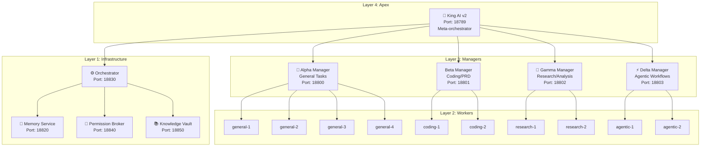
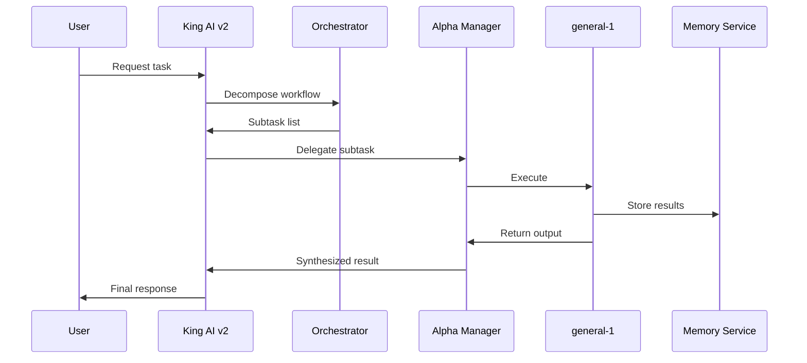

# King AI v2 - Architecture Overview

---
title: King AI v2 - Architecture Overview
agent: alpha-manager
date: 2026-03-10
version: 2.0.0
tags:
  - type/architecture
  - project/king-ai-v2
  - system/orchestrator
  - status/current
---

# King AI v2 - Architecture Overview

King AI v2 is the apex orchestrator in the ai_final multi-agent hierarchy. It coordinates all manager-level agents and maintains system-wide state.

## System Position

## Core Components

### 1. Meta-Orchestration Engine
- **Location:** Port 18830 (shared with worker-level orchestrator)
- **Function:** Task decomposition, workflow management, subtask distribution
- **Integration:** All managers report status here

### 2. Memory Service
- **Location:** Port 18820
- **Architecture:** 3-tier system
  - *Tier 1 (Redis):* Recent context, tool results
  - *Tier 2 (PostgreSQL):* Session summaries, cross-session learning
  - *Tier 3 (ChromaDB):* Long-term vector-indexed knowledge

### 3. Permission Broker
- **Location:** Port 18840
- **Function:** Hierarchical capability grants
- **Hierarchy:** King AI → Managers → Workers

### 4. Knowledge Vault
- **Location:** Port 18850
- **Format:** Obsidian-compatible Markdown
- **Purpose:** Structured documentation, research findings, code patterns

## Communication Patterns

## State Management

King AI v2 maintains:
- **Workflow registry:** Active/pending/completed workflows
- **Agent health status:** Online/offline/degraded states
- **Resource allocation:** Current load per agent
- **System alerts:** Errors requiring attention

## Integration Points

| Service | Port | Protocol | Purpose |
|---------|------|----------|---------|
| Memory Service | 18820 | HTTP/API | Context persistence |
| Orchestrator | 18830 | HTTP/API | Workflow management |
| Permission Broker | 18840 | File-based | Capability grants |
| Knowledge Vault | 18850 | HTTP/API | Documentation storage |
| Redis | 6379 | Redis | Tier-1 memory cache |
| PostgreSQL | 5432 | SQL | Tier-2 structured data |
| ChromaDB | 8000 | HTTP | Tier-3 vector search |

## Scalability Design

- **Horizontal:** Add worker agents to any manager
- **Vertical:** Managers can spawn sub-agents for overflow
- **Fallback:** If worker fails, task queues to manager
- **Circuit Breaker:** Unhealthy agents bypassed automatically

## Version History

| Version | Date | Changes |
|---------|------|---------|
| v1.0 | 2025-12 | Initial orchestrator implementation |
| v1.5 | 2026-02 | Added Knowledge Vault integration |
| v2.0 | 2026-03 | Full ai_final hierarchy, Memory Service v2 |

---
*Last updated: 2026-03-10*  
*Owner: King AI / Alpha Manager*  
*Related: [[king-ai-v2-capability-matrix]], [[king-ai-v2-lifecycle]], [[king-ai-v2-risk-profiles]]*
