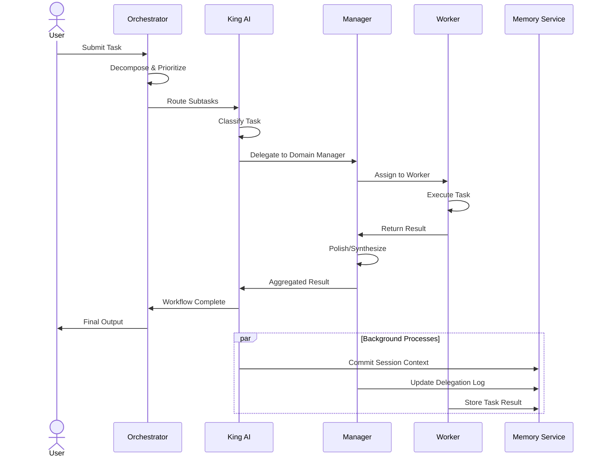
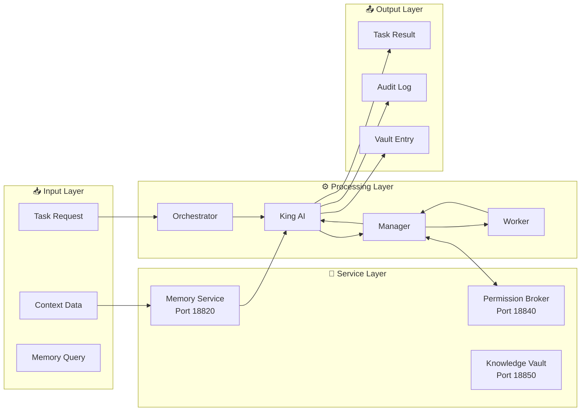

# King AI v2 — Architecture Overview

> **System:** ai_final (16-Agent Orchestration)  
> **Version:** 2.0  
> **Last Updated:** 2026-03-09  
> **Tags:** #ai_final #architecture #king-ai #orchestrator #mermaid

---

## Executive Summary

King AI v2 serves as the central orchestrator in the ai_final multi-agent hierarchy. It manages four domain-specific managers, each supervising four specialized workers, creating a scalable 16-agent architecture for distributed task execution.

---

## System Architecture

### Hierarchy Diagram

```mermaid
flowchart TB
    subgraph Orchestrator["🎛️ Orchestrator (Port 18830)"]
        ORCH["Meta-Orchestrator"]
    end

    subgraph KingTier["👑 King AI Tier (Port 18789)"]
        KING["King AI v2<br/>Central Coordinator"]
    end

    subgraph ManagerTier["🎯 Manager Tier (Ports 18800-18803)"]
        ALPHA["Alpha Manager<br/>18800 - General"]
        BETA["Beta Manager<br/>18801 - Coding"]
        GAMMA["Gamma Manager<br/>18802 - Research"]
        DELTA["Delta Manager<br/>18803 - Agentic"]
    end

    subgraph WorkerTierAlpha["Alpha Workers (18811-18814)"]
        A1["general-1<br/>18811 - Writing"]
        A2["general-2<br/>18812 - Summarization"]
        A3["general-3<br/>18813 - Q&A"]
        A4["general-4<br/>18814 - Mac Automation"]
    end

    subgraph WorkerTierBeta["Beta Workers (18821-18824)"]
        B1["coding-1<br/>18821 - Code Gen"]
        B2["coding-2<br/>18822 - Review"]
        B3["coding-3<br/>18823 - Debug"]
        B4["coding-4<br/>18824 - Refactor"]
    end

    subgraph WorkerTierGamma["Gamma Workers (18831-18834)"]
        G1["research-1<br/>18831 - Deep Search"]
        G2["research-2<br/>18832 - Analysis"]
        G3["research-3<br/>18833 - Synthesis"]
        G4["research-4<br/>18834 - Verification"]
    end

    subgraph WorkerTierDelta["Delta Workers (18841-18844)"]
        D1["agentic-1<br/>18841 - Planning"]
        D2["agentic-2<br/>18842 - Execution"]
        D3["agentic-3<br/>18843 - Validation"]
        D4["agentic-4<br/>18844 - Reflection"]
    end

    ORCH -->|"distributes workflows"| KING
    KING -->|"routes to"| ALPHA
    KING -->|"routes to"| BETA
    KING -->|"routes to"| GAMMA
    KING -->|"routes to"| DELTA

    ALPHA --> A1 & A2 & A3 & A4
    BETA --> B1 & B2 & B3 & B4
    GAMMA --> G1 & G2 & G3 & G4
    DELTA --> D1 & D2 & D3 & D4
```

---

## Communication Flow

---

## Component Specifications

### King AI (Port 18789)
| Attribute | Specification |
|-----------|---------------|
| **Role** | Central Coordinator |
| **Domain** | Cross-domain routing & escalation |
| **Workers Managed** | 4 Managers |
| **Memory Access** | Full (all tiers) |
| **Permission Authority** | Root-level |

### Manager Tier (Ports 18800-18803)
| Manager | Port | Domain | Specialty | Workers |
|---------|------|--------|-----------|---------|
| **Alpha** | 18800 | General | Synthesis & Polish | 4 |
| **Beta** | 18801 | Coding | PRD Implementation | 4 |
| **Gamma** | 18802 | Research | Deep Investigation | 4 |
| **Delta** | 18803 | Agentic | Autonomous Execution | 4 |

### Worker Tier (Ports 18811-18844)
Each manager supervises 4 workers with domain-specific capabilities. See [[02-agent-capability-matrix|Agent Capability Matrix]] for detailed specifications.

---

## Data Flow Architecture

---

## Port Allocation

| Range | Purpose |
|-------|---------|
| 18789 | King AI (Central) |
| 18800-18803 | Managers (Tier 1) |
| 18811-18814 | Alpha Workers |
| 18821-18824 | Beta Workers |
| 18831-18834 | Gamma Workers |
| 18841-18844 | Delta Workers |
| 18820 | Memory Service |
| 18830 | Orchestrator API |
| 18840 | Permission Broker |
| 18850 | Knowledge Vault |

---

## Related Documents
- [[02-agent-capability-matrix]] — Detailed capability specifications
- [[03-lifecycle-states]] — Business lifecycle documentation
- [[04-risk-profiles]] — Risk assessment framework
- [[05-integration-mapping]] — External API integrations

---
*Part of the ai_final Knowledge Vault*  
*Agent: alpha-manager*  
*Classification: system/architecture*
