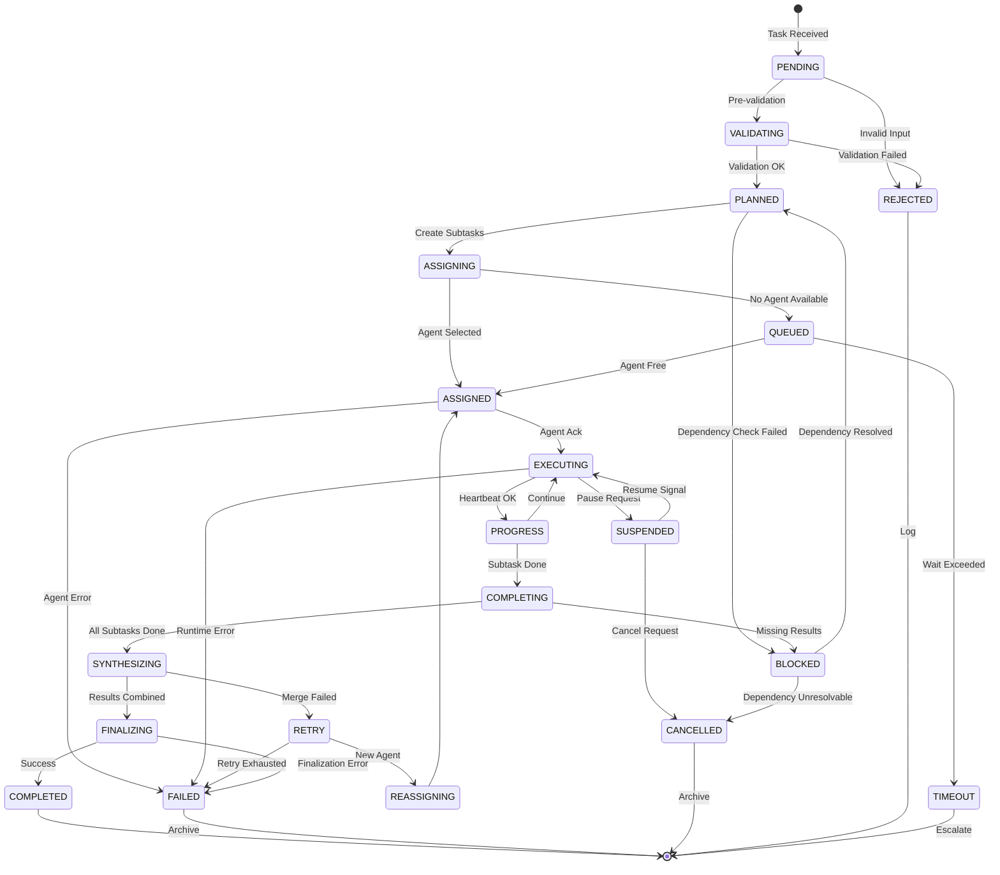

# King AI v2 — Business Lifecycle State Transitions

> **System:** ai_final (16-Agent Orchestration)  
> **Version:** 2.0  
> **Last Updated:** 2026-03-09  
> **Tags:** #ai_final #lifecycle #state-machine #business-logic #orchestrator

---

## Overview

The ai_final system employs a sophisticated micro-lifecycle for each task workflow. States track task progression from intake to completion, enabling recovery, retry logic, and audit trails.

---

## State Diagram



---

## State Definitions

### Initial States

| State | Description | Entry Actions | Exit Actions |
|-------|-------------|---------------|--------------|
| **PENDING** | Task received, awaiting triage | Log receipt, assign ID | Priority score calculated |
| **VALIDATING** | Input validation in progress | Validate schema, permissions | Validation report generated |
| **REJECTED** | Task failed validation | Log rejection reason | User notification |

### Planning States

| State | Description | Entry Actions | Exit Actions |
|-------|-------------|---------------|--------------|
| **PLANNED** | Subtasks created, plan ready | Dependency graph built | Resource allocation |
| **BLOCKED** | Dependencies not satisfied | List blockers, notify | Dependency resolved |
| **ASSIGNING** | Matching task to agent | Check agent availability | Agent selected |
| **QUEUED** | Waiting for available agent | Add to priority queue | Position in queue logged |

### Execution States

| State | Description | Entry Actions | Exit Actions |
|-------|-------------|---------------|--------------|
| **ASSIGNED** | Task assigned to specific agent | Notify agent, set timeout | Agent acknowledged |
| **EXECUTING** | Agent actively processing | Heartbeat monitoring begins | Progress logged |
| **PROGRESS** | Task progress reported | Update completion % | Continue/complete decision |
| **SUSPENDED** | Task paused (user or system) | Save state, free resources | Resume or cancel |
| **CANCELLED** | Task cancelled by user/system | Cleanup resources | Final status logged |

### Completion States

| State | Description | Entry Actions | Exit Actions |
|-------|-------------|---------------|--------------|
| **COMPLETING** | Subtask finished, awaiting synthesis | Result validation | Prepare for synthesis |
| **SYNTHESIZING** | Combining subtask results | Merge outputs | Quality check |
| **FINALIZING** | Preparing final output | Format result | Package for delivery |
| **COMPLETED** | Task successfully finished | Commit to memory | Notify orchestrator |
| **FAILED** | Task failed (irrecoverable) | Error analysis | Alert escalation |
| **TIMEOUT** | Task exceeded time limits | Timeout logged | Escalation triggered |
| **RETRY** | Retry after partial failure | Increment retry counter | Reassign or fail |
| **REASSIGNING** | Assigning to different agent | Log previous failure | New agent selected |

---

## State Transition Table

| Current State | Valid Next States | Trigger | Authorization |
|-------------|------------------|---------|---------------|
| PENDING | VALIDATING, REJECTED | Pre-validation complete | System |
| VALIDATING | PLANNED, REJECTED | Validation result | System |
| PLANNED | ASSIGNING, BLOCKED | Dependencies checked | System |
| ASSIGNING | ASSIGNED, QUEUED | Agent availability | Manager |
| QUEUED | ASSIGNED, TIMEOUT | Agent free / timeout | System |
| ASSIGNED | EXECUTING, FAILED | Agent acknowledgement | Worker |
| EXECUTING | PROGRESS, SUSPENDED, FAILED | Heartbeat / error | Worker |
| PROGRESS | COMPLETING, EXECUTING | Progress check | Worker |
| SUSPENDED | EXECUTING, CANCELLED | Resume / cancel signal | User/Manager |
| COMPLETING | SYNTHESIZING, BLOCKED | Completion check | Worker |
| SYNTHESIZING | FINALIZING, RETRY | Synthesis result | Manager |
| FINALIZING | COMPLETED, FAILED | Finalization check | Manager |
| RETRY | REASSIGNING, FAILED | Retry decision | Manager |
| REASSIGNING | ASSIGNED | New agent found | Manager |
| BLOCKED | PLANNED, CANCELLED | Dependency resolved | System/User |

---

## Lifecycle Metadata

Each task maintains a metadata object tracking its lifecycle:

```json
{
  "task_id": "f4769c1e-6e1",
  "subtask_id": "4e1e2910",
  "current_state": "COMPLETED",
  "state_history": [
    {"state": "PENDING", "timestamp": "2026-03-09T10:00:00Z", "actor": "orchestrator"},
    {"state": "VALIDATING", "timestamp": "2026-03-09T10:00:02Z", "actor": "system"},
    {"state": "PLANNED", "timestamp": "2026-03-09T10:00:05Z", "actor": "king-ai"},
    {"state": "ASSIGNED", "timestamp": "2026-03-09T10:00:10Z", "actor": "alpha-manager"},
    {"state": "EXECUTING", "timestamp": "2026-03-09T10:00:12Z", "actor": "general-1"},
    {"state": "PROGRESS", "timestamp": "2026-03-09T10:00:30Z", "actor": "general-1"},
    {"state": "COMPLETING", "timestamp": "2026-03-09T10:01:00Z", "actor": "general-1"},
    {"state": "SYNTHESIZING", "timestamp": "2026-03-09T10:01:02Z", "actor": "alpha-manager"},
    {"state": "FINALIZING", "timestamp": "2026-03-09T10:01:05Z", "actor": "alpha-manager"},
    {"state": "COMPLETED", "timestamp": "2026-03-09T10:01:10Z", "actor": "alpha-manager"}
  ],
  "retry_count": 0,
  "elapsed_ms": 70000,
  "risk_profile": "MODERATE",
  "assigned_agent": "agent:main:general-1"
}
```

---

## Error Handling

### Automatic Transitions

| Error Type | Current State | Auto-Transition | Action |
|------------|---------------|-----------------|--------|
| Validation error | VALIDATING | REJECTED | Log reason, notify |
| Agent timeout | ASSIGNED | TIMEOUT | Escalate to manager |
| Worker crash | EXECUTING | RETRY | Attempt reassignment |
| Resource unavailable | PLANNED | BLOCKED | Queue for retry |
| Merge failure | SYNTHESIZING | RETRY | Reassign to manager |

### Manual Interventions

| Scenario | Manual Action | Result State |
|----------|-------------|--------------|
| Retry exhausted | Manager override | Reassigned to new worker |
| Dependency fixed | User signal | BLOCKED → PLANNED |
| Emergency stop | User cancel | Any → CANCELLED |
| Force completion | Manager complete | Bypass to COMPLETED |

---

## Related Documents
- [[01-architecture-overview]] — System architecture
- [[02-agent-capability-matrix]] — Agent