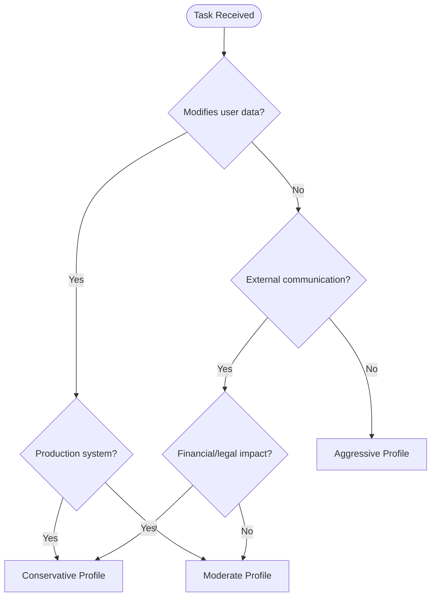
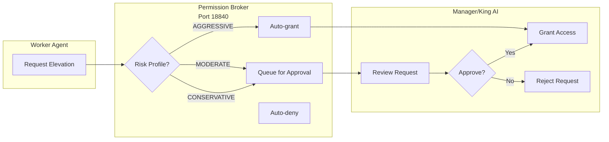

# King AI v2 — Risk Profile Comparison

> **System:** ai_final (16-Agent Orchestration)  
> **Version:** 2.0  
> **Last Updated:** 2026-03-09  
> **Tags:** #ai_final #risk #profiles #safety #governance #decision-making

---

## Overview

The ai_final system implements three-tier risk profiles that govern agent behavior, tool access, and escalation requirements. Every task is classified into a risk profile that determines approval gates, logging verbosity, and fallback strategies.

---

## Risk Profile Decision Tree

---

## Risk Profile Comparison Matrix

| Dimension | Conservative | Moderate | Aggressive |
|-----------|--------------|----------|------------|
| **Use Cases** | Financial, medical, legal, production deploys | General tasks, user interactions | Research, exploration, dev/test |
| **Approval Required** | Yes (King AI or User) | Manager-level | Worker autonomous |
| **Tool Access** | Read-only + curated writes | Standard | Full (elevated if granted) |
| **External APIs** | Whitelist only | Standard list | All available |
| **Exec/Shell** | No | Request elevation | Standard |
| **Memory Writes** | Logged + reviewed | Logged | Auto-commit |
| **Retry Logic** | Max 2, manual resume | Max 3, auto-retry | Max 5, aggressive |
| **Rollback Plan** | Required before start | Suggested | Best-effort |
| **Audit Level** | Verbose (all actions) | Standard | Minimal (errors only) |
| **Cost Limits** | Budget-checked per action | Daily budget monitored | No limits |
| **Reasoning Mode** | Enterprise (full governance) | Reflective | ReAct |

---

## Conservative Profile

> **Tag:** `risk:conservative`  
> **Hex:** 🔴 #E74C3C

### Description
Maximum safety for high-stakes operations. Assumes worst-case scenarios.

### Trigger Conditions
- [ ] Modifies production databases
- [ ] Sends emails/SMS to users
- [ ] Handles financial transactions
- [ ] Processes medical records
- [ ] Legal document generation
- [ ] Security policy changes
- [ ] Account modification (passwords, permissions)

### Requirements
| Requirement | Enforcement |
|-------------|-------------|
| Pre-approval | King AI or User explicit approval required |
| Rollback plan | Must exist before execution |
| Tool whitelist | Curated list only (web_search, read, memory_query) |
| Audit trail | Verbose logging (every action) |
| Success criteria | Defined upfront, verified after |

### Allowed Operations
- ✅ Read files (any location)
- ✅ Web search/fetch
- ✅ Memory queries
- ✅ Generate reports/plans
- ❌ File writes (except approved outputs)
- ❌ Shell execution
- ❌ External communication
- ❌ Git push to protected branches
- ❌ Elevated operations

---

## Moderate Profile

> **Tag:** `risk:moderate`  
> **Hex:** 🟡 #F39C12

### Description
Standard operations with appropriate safeguards. Balanced safety and efficiency.

### Trigger Conditions
- [ ] Updates internal documentation
- [ ] Creates file drafts (not production)
- [ ] Code review and analysis
- [ ] Local testing (non-production)
- [ ] File operations in development directories
- [ ] Web research
- [ ] Memory updates and queries
- [ ] Sub-agent spawning (supervised)

### Requirements
| Requirement | Enforcement |
|-------------|-------------|
| Manager approval | Required for exec/shell |
| Elevated access | Requested via permission broker |
| Retry logic | Up to 3 automatic retries |
| Audit level | Standard (errors + key actions) |
| Cost monitoring | Daily budget tracked |

### Allowed Operations
- ✅ Read files (any location)
- ✅ Web search/fetch  
- ✅ Memory operations (query, commit, diary)
- ✅ File writes (sandbox/dev directories)
- ✅ Sub-agent spawn (tracked)
- ✅ Browser automation
- ✅ Image generation (sanctioned)
- ✅ TTS generation
- ⚠️ Exec/shell (elevation required)
- ❌ Production file writes
- ❌ Git push to protected branches
- ❌ External communication (email/sms)

---

## Aggressive Profile

> **Tag:** `risk:aggressive`  
> **Hex:** 🟢 #27AE60

### Description
Maximum autonomy for exploratory work. Accepts higher failure rates for speed.

### Trigger Conditions
- [ ] Prototype development
- [ ] Proof-of-concept building
- [ ] Information gathering (web crawling)
- [ ] Local experimentation
- [ ] Bulk processing (test data)
- [ ] Pattern analysis on scratch data
- [ ] AI/model exploration

### Requirements
| Requirement | Enforcement |
|-------------|-------------|
| Autonomous execution | Worker decides tool usage |
| Elevated access | Granted if pre-approved |
| Retry logic | Up to 5 aggressive retries |
| Audit level | Minimal (errors only) |
| Cost limits | Capped at daily limit |

### Allowed Operations
- ✅ All file operations (including writes)
- ✅ All web operations
- ✅ All memory operations
- ✅ All browser automation
- ✅ Sub-agent spawning
- ✅ Image generation
- ✅ Audio generation
- ✅ Coding agents (Codex/Claude)
- ✅ Reasoning patterns (all types)
- ⚠️ Exec/shell (elevation recommended)
- ⚠️ Git operations (review branch)
- ⚠️ External APIs (check auth)

---

## Risk Escalation Matrix

| Situation | From | To | Trigger |
|-----------|------|-----|---------|
| Production impact detected | AGGRESSIVE | MODERATE | File path match |
| Financial data detected | ANY | CONSERVATIVE | Content scan |
| PII detected in output | ANY | CONSERVATIVE | Data classifier |
| Retry exhaustion | MODERATE | CONSERVATIVE | Failure count |
| User override | ANY | OVERRIDE | Explicit signal |
| Emergency stop | ANY | CANCELLED | User interrupt |

---

## Permission Broker Integration

The risk profile determines how the permission broker handles elevation requests:

---

## Implementation Notes

### Setting Risk Profile
Risk profiles can be set at multiple levels:

1. **System Default** — Set in gateway config
2. **Per-Workflow** — Orchestrator sets at creation
3. **Per-Task** — Manager overrides for subtask
4. **Per-Tool-Call** — Auto-detected heuristics

### Risk Detection Heuristics

| Heuristic | Conservative | Moderate | Aggressive |
|-----------|--------------|----------|------------|
| Path contains `production/` | ✅ | ❌ | ❌ |
| File is `.env` / config | ✅ | ✅ | ❌ |
| Command is `rm -rf` | ✅ | ✅ | ❌ |
| URL matches `*.vcs` | ✅ | ❌ | ❌ |
| Content contains credit card | ✅ | ✅ | ❌ |

---

## Related Documents
- [[01-architecture-overview]] — System architecture
- [[02-agent-capability-matrix]] — Agent capabilities
- [[03-lifecycle-states]] — Task lifecycle states
- [[05-integration-mapping]] — External API integrations

---
*Part of the ai_final Knowledge Vault*  
*Agent: alpha-manager*  
*Classification: system/risk*
