# King AI v2 — Integration Mapping

> **System:** ai_final (16-Agent Orchestration)  
> **Version:** 2.0  
> **Last Updated:** 2026-03-09  
> **Tags:** #ai_final #integrations #api #external-systems #connectors

---

## Integration Overview

King AI v2 connects to a broad ecosystem of external services, APIs, and local tools. This document maps each integration, its authentication method, data flow, and risk classification.

---

## Integration Architecture

```mermaid
flowchart TB
    subgraph KING["👑 King AI v2"]
        CORE[Core Orchestrator]
    end

    subgraph Local["🖥️ Local Services"]
        MEM[Memory Service<br/>Port 18820]
        PERM[Permission Broker<br/>Port 18840]
        VAULT[Knowledge Vault<br/>Port 18850]
        ORCH[Orchestrator API<br/>Port 18830]
        TTS[(TTS Service)]
        WHISPER[(Whisper Local)]
    end

    subgraph CloudAPI["☁️ Cloud APIs"]
        OPENAI[OpenAI API]
        CLOUDE[Claude API]
        NVAPI[NVAPI<br/>Free Models]
        ELEVEN[ElevenLabs]
        BRAVE[Brave Search]
    end

    subgraph Enterprise["🏢 Enterprise Systems"]
        GITHUB[GitHub API]
        GCAL[Google Calendar]
        GMAIL[Gmail API]
        GDRIVE[Google Drive]
        SLACK[Slack API]
    end

    subgraph Platform["📱 Platform Services"]
        DISCORD[Discord Bot]
        TELEGRAM[Telegram Bot]
        SIGNAL[Signal]
        IMSG[iMessage]
        WACLI[WhatsApp CLI]
    end

    CORE <-->|HTTP| MEM
    CORE <-->|HTTP| PERM
    CORE <-->|HTTP| VAULT
    CORE <-->|HTTP| ORCH
    CORE <-->|Local| TTS
    CORE <-->|Local| WHISPER

    CORE -->|HTTPS| OPENAI
    CORE -->|HTTPS| CLOUDE
    CORE -->|HTTPS| NVAPI
    CORE -->|HTTPS| ELEVEN
    CORE -->|HTTPS| BRAVE

    CORE -->|HTTPS| GITHUB
    CORE -->|HTTPS| GCAL
    CORE -->|HTTPS| GMAIL
    CORE -->|HTTPS| GDRIVE
    CORE -->|HTTPS| SLACK

    CORE -->|WebSocket| DISCORD
    CORE -->|HTTPS| TELEGRAM
    CORE -->|Local| SIGNAL
    CORE -->|Local| IMSG
    CORE -->|Local| WACLI
```

---

## Integration Catalog

### ☁️ AI/LLM APIs

#### OpenAI API
| Attribute | Details |
|-----------|---------|
| **Purpose** | GPT models, embeddings, image generation |
| **Endpoint** | `https://api.openai.com/v1` |
| **Auth** | API Key (`OPENAI_API_KEY`) |
| **Used By** | All managers (fallback), image generation |
| **Rate Limit** | Tier-dependent, 60 RPM default |
| **Cost** | Pay-per-token |
| **Risk Level** | Medium (data leaves premises) |
| **NVAPI Alternative** | Yes (kimi-k2.5, deepseek-r1, glm-5) |

#### Claude API (Anthropic)
| Attribute | Details |
|-----------|---------|
| **Purpose** | Claude 3.5/4 models, computer use |
| **Endpoint** | `https://api.anthropic.com/v1` |
| **Auth** | API Key (`ANTHROPIC_API_KEY`) |
| **Used By** | Delta manager, coding agents |
| **Rate Limit** | Tier-dependent |
| **Cost** | Pay-per-token |
| **Risk Level** | Medium |

#### NVAPI (NVIDIA)
| Attribute | Details |
|-----------|---------|
| **Purpose** | Free model inference (kimi, deepseek, glm) |
| **Endpoint** | `https://integrate.api.nvidia.com/v1` |
| **Auth** | API Key (`NVAPI_KEY`) |
| **Used By** | Default for most agents |
| **Rate Limit** | 40 RPM (can request increase) |
| **Cost** | **$0.00** (FREE) |
| **Risk Level** | Low |

---

### 🔍 Search & Knowledge

#### Brave Search API
| Attribute | Details |
|-----------|---------|
| **Purpose** | Web search, image search, news |
| **Endpoint** | `https://api.search.brave.com/res/v1` |
| **Auth** | API Key (`BRAVE_API_KEY`) |
| **Used By** | `web_search` tool (all agents) |
| **Quota** | 2000 queries/month free tier |
| **Cost** | Free tier available |
| **Risk Level** | Low |

#### Knowledge Vault (Local)
| Attribute | Details |
|-----------|---------|
| **Purpose** | Internal Obsidian vault, persistent knowledge |
| **Endpoint** | `http://localhost:18850` |
| **Protocol** | HTTP REST |
| **Used By** | All agents (auto-commit) |
| **Storage** | Local filesystem |
| **Backup** | Git sync to private repo |
| **Risk Level** | None (local only) |

---

### 🎵 Audio Services

#### ElevenLabs
| Attribute | Details |
|-----------|---------|
| **Purpose** | Text-to-speech, voice cloning |
| **Endpoint** | `https://api.elevenlabs.io/v1` |
| **Auth** | API Key (`ELEVENLABS_API_KEY`) |
| **Used By** | `tts` tool |
| **Cost** | ~$0.30/1000 characters |
| **Risk Level** | Low |

#### OpenAI Whisper (Local)
| Attribute | Details |
|-----------|---------|
| **Purpose** | Speech-to-text (local) |
| **Endpoint** | Local subprocess |
| **Model** | whisper.cpp / openai-whisper |
| **Used By** | `openai-whisper` skill |
| **Cost** | **$0.00** (local compute) |
| **Risk Level** | None (local only)